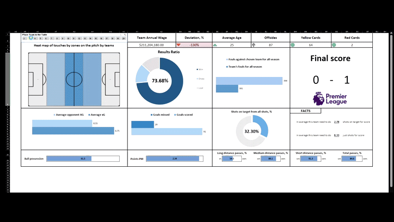
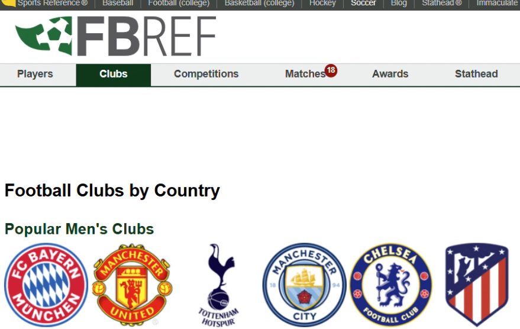
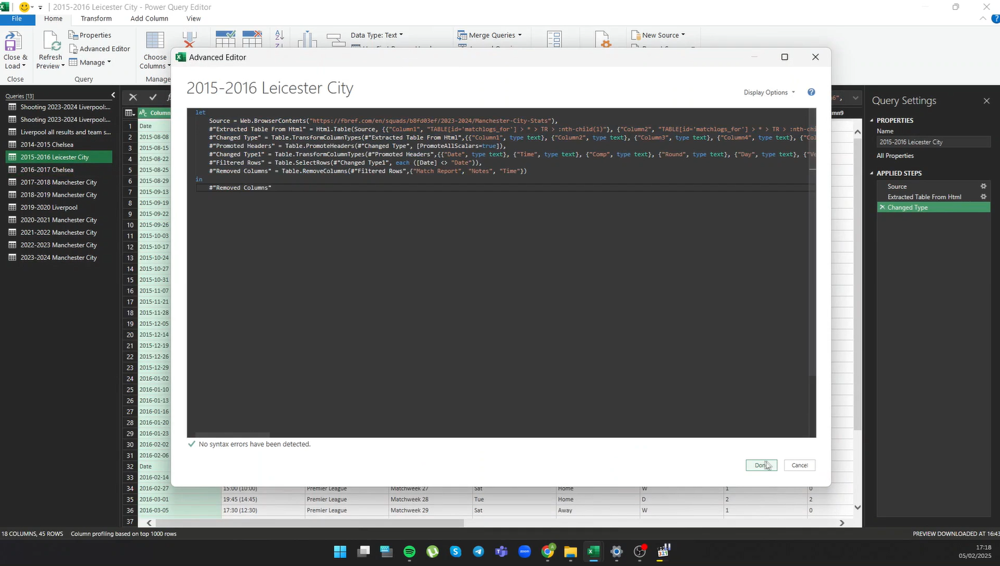
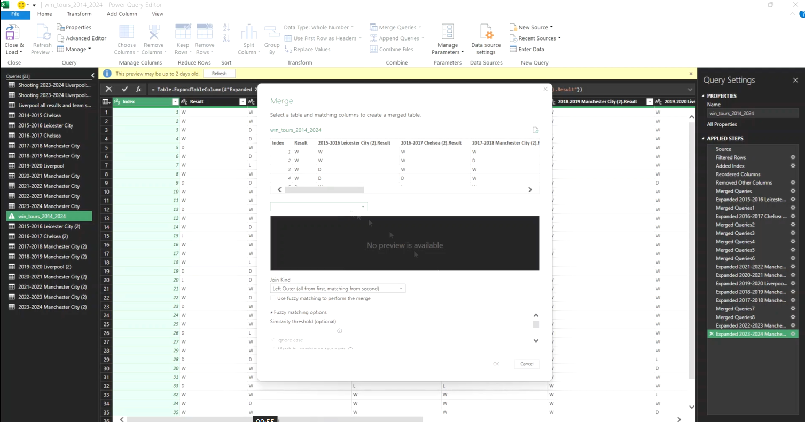
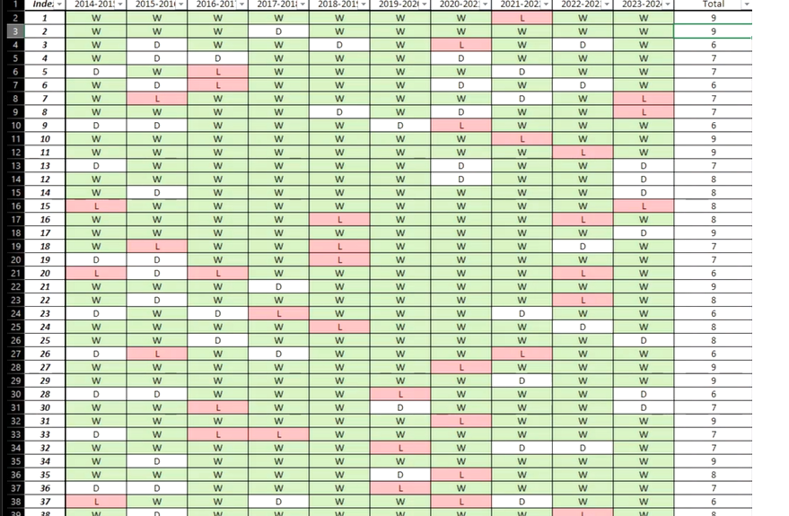
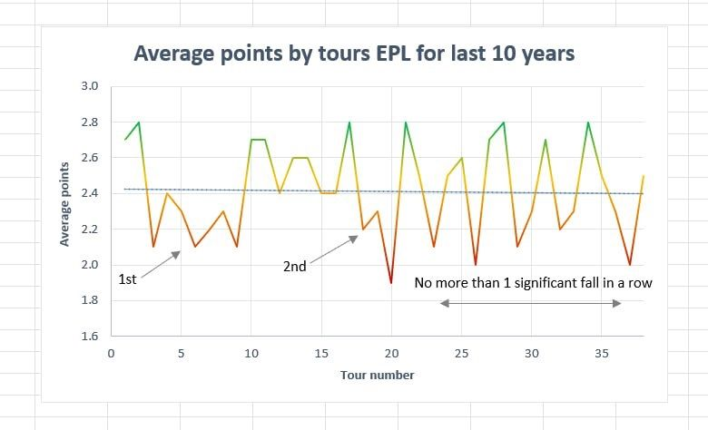

# **Excel EPL Analysis Project** *(In Progress)*  

This project is my personal research on the **English Premier League (EPL)** using **Excel** and **Power Query**.  

Over the last decade, we've witnessed an explosion of football data—**xG (Expected Goals), player statistics, and countless other metrics**—providing an incredible opportunity for deep analysis.  

📊 **Objective:** Uncover meaningful insights from **10+ years of EPL data** by **collecting, transforming, and visualizing key trends**.  

---

## **Episode 1: Data Collection & Preparation**  

🔗 [Watch on LinkedIn](https://www.linkedin.com/posts/activity-7293237953995169792-YBYH?utm_source=share&utm_medium=member_desktop&rcm=ACoAADpQVc4BrwbeJFx-PIAICJAsX_a9lFKcf8k)  

### **Step 1: Finding the Right Data Source**  
To conduct an effective analysis, I needed a **reliable and structured data source**. After exploring multiple platforms, I chose **[FBRef.com](https://fbref.com/)**, which provides detailed EPL statistics in an accessible format.  

### **Step 2: Extracting & Transforming Data**  
Using **Power Query**, I:  
✅ Pulled raw data from **FBRef.com**  
✅ Cleaned, structured, and transformed the dataset  
✅ Loaded it into **Excel** for further analysis  

---

## **Episode 2: Analyzing Average Points Per Matchweek**  

🔗 [Watch on LinkedIn](https://www.linkedin.com/posts/activity-7295049085122744322-hLkt?utm_source=share&utm_medium=member_desktop&rcm=ACoAADpQVc4BrwbeJFx-PIAICJAsX_a9lFKcf8k)  

The **first layer of analysis** explores the **average points per matchweek** throughout the season—a **simple yet insightful** metric for understanding trends across the league.  

📈 **Process:**  
- Filtered, cleaned, and merged relevant data  
- Created **summary tables** and **charts** to visualize key patterns  

---

## **Episode 3: Identifying Key Trends**  

### **Seasonal Performance Patterns**  

📌 Analysis of **10+ years of EPL data** reveals two **distinct declining trends**:  

1️⃣ **Season Kickoff** – Teams take time to adapt, implement tactics, and integrate new signings.  
2️⃣ **Boxing Day Period (December)** – The most **intense** stretch of the season, leading to fatigue and unpredictable results.  

⚡ **Post-December Recovery:**  
- The **second half of the season** sees **more stable performances**, though injuries and fatigue influence short-term dips.  
- Typically, teams **don’t drop more than one game below trend** unless impacted by significant injuries.  

---

## **Episode 4: Consolidating Last Season’s Data**  

### **Building a Comprehensive Data Table**  

To gain deeper insights, I compiled **all key statistics from the last EPL season** into a single table. This involved:  
✅ Merging data from **9 different tables**  
✅ Connecting by **matchweek** and **team**  
✅ Cleaning and structuring the dataset  
✅ Sorting for better analysis  

📊 **Final dataset:** **64 columns** of detailed and exhaustive EPL data.  

🎥 **See the final result in the video below!**  

---

## **Next Steps & Future Insights**  

🔎 **This is just the beginning!** I have multiple **analysis objectives**, and I’ll be sharing insights step by step. Stay tuned for:  
- **Team-specific trends & performance patterns**  
- **Impact of new signings & tactical shifts**  
- **Comparative analysis of top teams over the years**  

Let me know if you have any thoughts or suggestions! 🚀

Let me know if you have any thoughts or suggestions! 🚀

